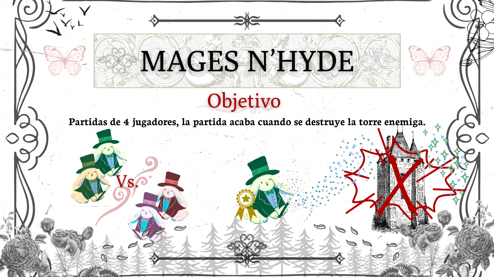
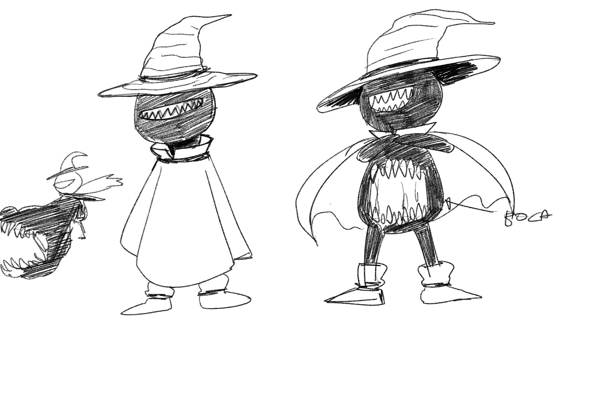
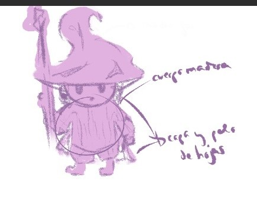
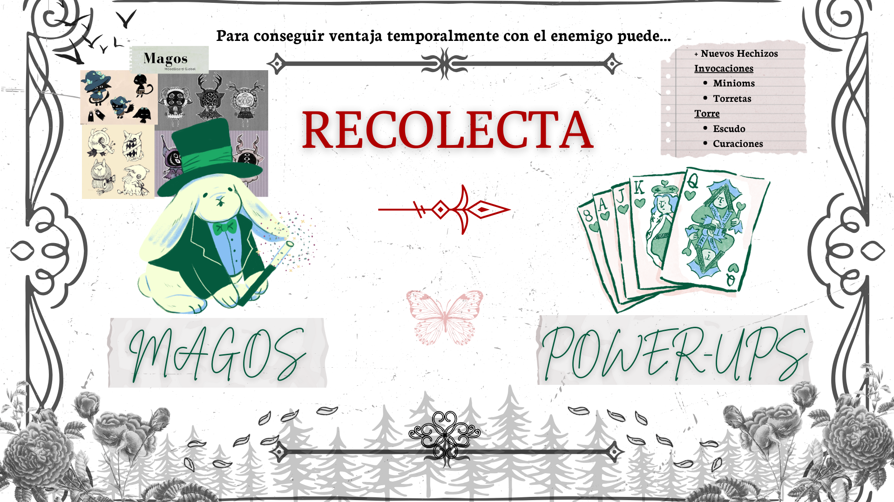
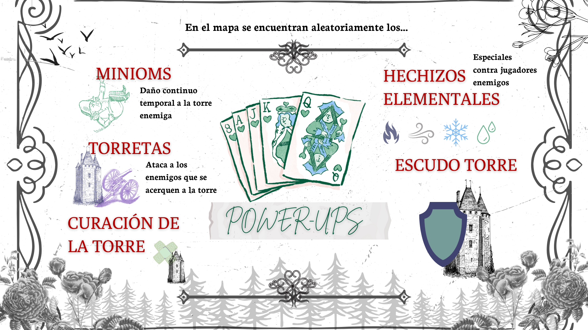
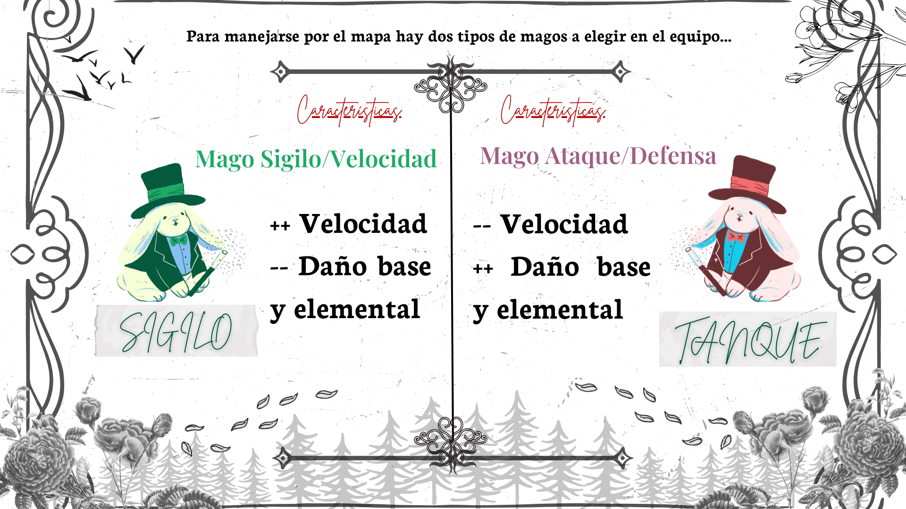
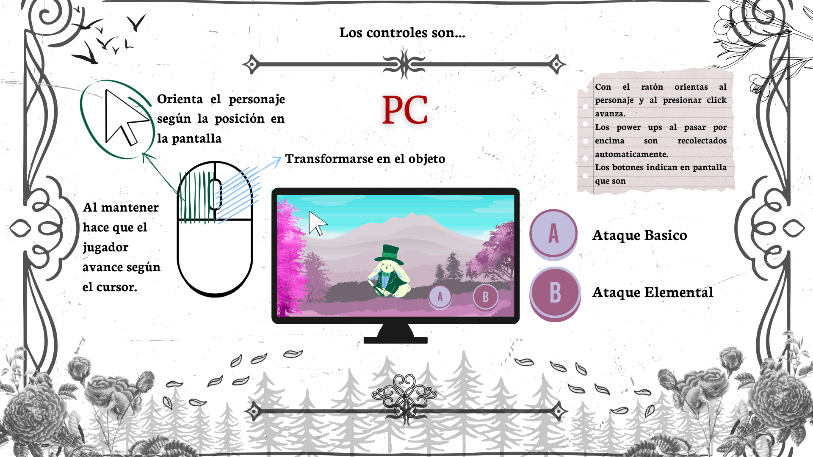
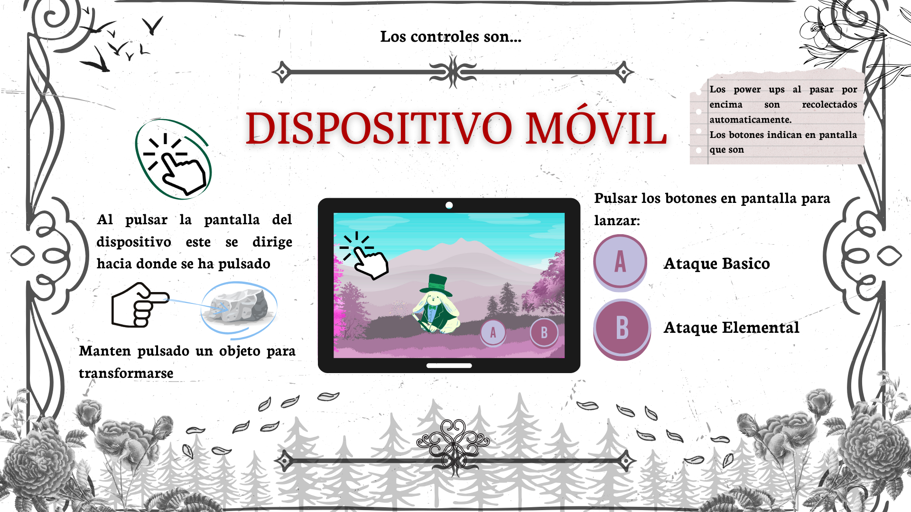

# Mage n'Hyde

## Game Document Design

**Made by:**

**Mojito Studios**

**Integrantes Grupo C**

- Irene Rodríguez García
- Miriam Sanz Tardón
- Rosa Ghaudy Bellido Euribe
- Sandra Martín-Consuegra Molina-Prados
- Hugo Camacho Rodríguez
- Pablo Melgar Álvarez

**Preface.**

En Mojito Studios, creemos en el poder de la creatividad y la innovación. Mage n' Hyde nace de nuestra pasión por combinar géneros únicos para crear experiencias nuevas y diferentes a lo ya conocido en videojuegos de este género.

Para este proyecto se busca crear un videojuego desafiante, dinámico y sobre todo, divertido para jugadores experimentados y jugadores más casuales. Desde su concepto hasta su finalización en los próximos meses se pondrá todo el esfuerzo posible en cada diseño del aspecto visual y cada mecánica y detalle que conformará al juego.

Nuestro equipo está compuesto por un grupo diverso de personas con gran talento y una visión única que harán de este videojuego un producto innovador y diferente.

**Contents.** _Tabla de contenido_

1. **Game Concept.**
    1. Introduction
    2. Background
    3. Description
    4. Key features
    5. Genre
    6. Platform
    7. Concept Art
2. **Game Mechanics.**
    1. Core Gameplay
    2. Game Flow
    3. Characters/Mages
    4. Tower/Minions
    5. Game Play Elements
    6. Weapon Properties
    7. Game Physics and statistics
    8. Artificial Intelligence
    9. Player Controls
3. **Interface.**
    1. FlowCharts
    2. Functional Requirements
    3. Mock Up Screens
4. **Art And Video.**
    1. OverAll Goals
    2. 2D Art
    3. 2D Animation
5. **Sound And Music.**
    1. Overall Goals
    2. Sound Effects & Music
6. **Story.**
    1. Story overview.
    2. Ending.
7. **Level Overview.**
    1. Location overviews.
    2. Power-Ups.
8. **Market Analysis.**
    1. Target Market.
9. **Monetización y modelo de negocio.**
    1. Tipo de modelo de monetización
    2. Tablas de productos y precios.
10. **Planificación.**
    1. El equipo humano
    2. Estimación temporal del desarrollo
11. **Bibliography.**

### **Game Concept.**

1. **Introduction.**

_Mage n' Hyde_ es un juego competitivo diseñado para dos contra dos jugadores que combina estratégicamente elementos de los géneros Prop Hunt y MOBA. Este juego único permite a los jugadores transformar su entorno, esconderse y planear sus ataques mientras buscan destruir la torre enemiga. Cada jugador puede seleccionar entre personajes con habilidades mágicas únicas, según el rol que desea tener, lo que añade una capa de profundidad táctica tanto en ataque como en defensa. A lo largo de la partida, los jugadores podrán utilizar power-ups para invocar criaturas y mejorar sus hechizos, todo mientras intentan superar a su oponente en un campo de batalla dinámico y en constante evolución.

El concepto principal de _Mage n' Hyde_ es crear una experiencia divertida, competitiva y accesible, donde el ingenio y la estrategia juegan un rol crucial en cada enfrentamiento. Diseñado para ser rejugable y mantener el interés de los jugadores a lo largo del tiempo. _Mage n' Hyde_ busca posicionarse en la escena de los juegos multijugador como una alternativa fresca y emocionante en el mundo de los videojuegos indies competitivos.

2. **Background.**

El concepto de _Mage n' Hyde_ surge de la fusión de dos géneros populares: Prop Hunt y MOBA. La idea nace de la necesidad de crear una experiencia competitiva para dos jugadores en cada equipo que integre la estrategia de esconderse y la táctica de combate en tiempo real. Este proyecto está inspirado en la creciente popularidad de los juegos indie multijugador y en la comunidad competitiva que busca experiencias frescas y emocionantes.

Además, el equipo suele jugar a títulos de estos dos géneros como el _League of Legends_, MOBA, y el Witch it del género de _PropHunt_, permitiendo así saber cuales son los puntos más interesantes e importantes para poder mezclarlos y así conseguir obtener la mejor experiencia de ambos géneros.

Se busca la innovación, algo único y que pueda destacar, para ello se le ha prestado atención a la jugabilidad creando una dinámica que permita tanto el sigilo como la acción estratégica. _Mage n' Hyde_ se centra en la dualidad entre el esconderse y atacar, con el objetivo final de destruir la torre enemiga mientras que la cooperación con el otro jugador que defiende la base y mientras se esconde. Esta combinación de elementos proporciona un enfoque único al gameplay competitivo, alejándose de las mecánicas tradicionales de los MOBA al integrar la transformación en objetos y un enfoque diferente para el uso de power-ups para progresar en el juego.

El juego está diseñado para ser accesible a una amplia audiencia, desde jugadores casuales hasta competitivos, con un modelo de negocio freemium. Se facilita su disponibilidad en dispositivos móviles y otras plataformas. Además, se asegura de mantener la longevidad mediante la introducción de actualizaciones y contenidos estéticos.

3. **Description.**

Cada jugador antes de la partida comienza en el lobby eligiendo un personaje con habilidades únicas. El objetivo principal es destruir la torre del oponente. Al inicio del juego, ambos jugadores tienen un tiempo limitado para transformarse en objetos del entorno y ocultarse. Cada equipo es transparente uno al otro, una vez que el temporizador termina, se abren las bases y los jugadores pueden verse.

Durante la partida, los jugadores deben recolectar power-ups, que les permitirán crear hechizos nuevos como invocar minions para atacar la base enemiga, mejorar sus hechizos y obtener habilidades defensivas o de ataque.

El juego se desarrolla con un ritmo acelerado donde esconderse y atacar estratégicamente es crucial para la victoria.

4. **Key features.**
- _Unique Blend of Prop Hunt and MOBA Gameplay:_ Mage n' Hyde ofrece una fusión innovadora entre la jugabilidad estratégica de los juegos MOBA y la diversión impredecible del clásico Prop Hunt. Los jugadores pueden transformarse en objetos del entorno para esconderse y atacar a su oponente con inteligencia, creando una experiencia que combina tensión y estrategia. Esta mezcla da lugar a partidas dinámicas donde el sigilo y el engaño son tan importantes como las habilidades de combate.
- _Character Abilities and Power-Ups:_ Cada jugador en Mage n' Hyde controla un mago con habilidades especiales que pueden ser mejoradas a lo largo de la partida mediante power-ups. Estos potenciadores incluyen mejoras para sus hechizos, invocación de minions para atacar la torre del oponente, y escudos defensivos para proteger su propia base. Los jugadores deben gestionar cuidadosamente sus recursos y habilidades para dominar la partida.
- _Dynamic Environment with Prop Transformations:_ El juego permite a los jugadores transformarse en cualquier objeto del entorno, introduciendo una capa de engaño y estrategia. Esta mecánica única ofrece infinitas posibilidades para emboscar al oponente o esquivar sus ataques, mientras los jugadores exploran el mapa para esconderse, recolectar recursos o preparar una ofensiva. La naturaleza impredecible de las transformaciones mantiene cada partida fresca y emocionante.
- _Fast-Paced Competitive Rounds:_ Las partidas en Mage n' Hyde son cortas pero intensas, diseñadas para ofrecer una experiencia rápida y competitiva. El juego se desarrolla en partidas dinámicas en las que los jugadores deben esconderse, planear ataques y utilizar sus habilidades para destruir la torre enemiga.
- _Multiplayer Mode:_ Con un enfoque en el modo de cuatro jugadores, Mage n' Hyde es ideal para competiciones dos contra dos, donde cada jugador debe usar su ingenio y habilidades para ganar. El juego está diseñado para integrar un sistema multijugador online, permitiendo a los jugadores desafiar a amigos o competir en torneos globales. Este enfoque multijugador agrega una gran rejugabilidad, con enfrentamientos diferentes en cada partida.
- _Stylized Visuals and Immersive Sound Design:_ Mage n' Hyde presenta gráficos estilizados y una atmósfera visual que combina fantasía y terror, destacando los hechizos y transformaciones de los jugadores con efectos visuales impactantes. El diseño de sonido juega un papel crucial para sumergir a los jugadores, ya que cada acción, transformación o ataque se acompaña de efectos sonoros envolventes, ayudando a aumentar la tensión y la inmersión en cada PARTIDA.
- _Cross-Platform Play:_ El juego está diseñado para ser accesible en múltiples plataformas, incluyendo PC y dispositivos móviles, lo que permite a los jugadores disfrutar de Mage n' Hyde en cualquier momento y lugar. Con servidores dedicados, el juego ofrecerá una experiencia fluida y competitiva, independientemente del dispositivo que se utilice.
  
5. **Genre.**

Mage n' Hyde combina dos géneros de videojuegos muy diferentes, Prop Hunt y MOBA, para ofrecer una experiencia única y fresca. Al igual que los clásicos juegos de Prop Hunt, los jugadores pueden transformarse en objetos del entorno para ocultarse, añadiendo una capa de engaño y sigilo. Sin embargo, Mage n' Hyde también incorpora elementos estratégicos y competitivos de los juegos MOBA, como el uso de habilidades especiales y la defensa de torres.

A diferencia de los MOBA tradicionales, Mage n' Hyde introduce un enfoque más rápido y dinámico, con partidas uno contra uno que requieren tanto estrategia táctica como habilidad para esconderse y atacar. Esta fusión crea una experiencia de juego única, donde el sigilo y el combate estratégico coexisten, brindando una propuesta novedosa y desafiante.

6. **Platform.**

El juego está diseñado para ser multiplataforma, adaptable a PC y dispositivos móviles. El ordenador será nuestra plataforma principal.

7. **Concept Art.**

Se realizarán en la versión beta cuando se solidifiquen las mecánicas implementadas, para así saber cómo de grande o costoso pueden ser los dibujos aunque en un principio todos con 72 pp

Referencias de los Magos

Concept de Mago

Concept de MInions

### **Game Mechanics.**

1. **Core Gameplay.**

El núcleo de la jugabilidad en Mage n' Hyde será una mezcla de estrategia de combate y sigilo de transformación, ambos fundamentales para progresar y derrotar al oponente.

Combate –El combate en Mage n' Hyde se centrará en el uso de habilidades mágicas para atacar y destruir la torre del enemigo mientras defiende la propia. Cada jugador controlará un mago con un conjunto de habilidades especiales que pueden mejorar durante el transcurso de la partida mediante power-ups y recursos recolectados. Los jugadores no sólo pelearán sino que tendrán que utilizar el entorno y sus transformaciones para atacar de manera estratégica o emboscar a sus oponentes.

Una de las mecánicas clave que diferencia a Mage n' Hyde de otros juegos es el uso de objetos del entorno. Los jugadores pueden transformarse en estos objetos para esconderse y evadir ataques o sorprender a su oponente. Esta dinámica crea un ritmo de juego que alterna entre momentos de tensión, donde los jugadores se ocultan, y enfrentamientos explosivos, cuando se revelan para atacar.

Los jugadores deberán equilibrar el uso de sus habilidades ofensivas y defensivas, mientras manejan la recolección de power-ups en el mapa, que pueden marcar la diferencia en momentos cruciales. Este enfoque fomenta la estrategia en el uso de las habilidades, en lugar de depender únicamente de reflejos rápidos.

Sigilo y Transformaciones –Uno de los elementos más distintivos de Mage n' Hyde es su mecánica de sigilo y transformación. Al inicio de la partida, ambos jugadores tienen la oportunidad de transformarse en cualquier objeto del entorno para pasar desapercibidos. A diferencia de otros juegos de transformación, aquí el objetivo no es solo evitar ser descubierto, sino también planear ataques estratégicos desde una posición oculta.

La tensión aumenta ya que los jugadores nunca están seguros de dónde se esconde su oponente, lo que añade una capa de confusión y sorpresa a cada encuentro. ¿Ese árbol es en realidad tu enemigo? Lo impredecible es una parte clave de la experiencia, creando un ambiente donde cada acción debe ser calculada.

Puzzles Estratégicos –A lo largo de la partida, los jugadores deberán tomar decisiones estratégicas para conseguir power ups y activar las habilidades. Estos "puzzles" no son del estilo tradicional, sino más bien desafíos tácticos donde los jugadores deben gestionar sus habilidades para superar a su oponente. A diferencia de otros juegos donde los power-ups están disponibles de manera aleatoria, en Mage n' Hyde están colocados estratégicamente en el mapa, incentivando el riesgo y la exploración. Este enfoque fomenta un juego de alto riesgo y alta recompensa, donde moverse de forma descuidada podría revelar tu ubicación, pero también podría garantizarte la ventaja necesaria para destruir la torre enemiga.

2. **Game Flow.**

El flujo típico de juego en Mage n' Hyde sigue una estructura competitiva de partidas rápidas y estratégicas, diseñadas para mantener el ritmo acelerado y la tensión. Cada partida es un dos contra dos, donde los jugadores alternan entre esconderse y atacar. El ciclo de juego involucra varios elementos clave:

- Preparación Inicial:
    1. Al comienzo de cada partida, ambos jugadores son asignados a un mapa donde tienen unos segundos para explorar el entorno y prepararse.
    2. Durante este tiempo, los jugadores pueden transformarse en objetos del entorno para ocultarse y empezar a planificar su estrategia. También pueden decidir si recolectar power-ups o tomar una posición defensiva cerca de su base.

1. Exploración y Recolección:
    1. Durante la partida, los jugadores deben explorar el mapa para recolectar power-ups que mejoren sus habilidades o invoquen minions. Están dispersos por el escenario y aparecen cada determinado tiempo, van apareciendo de uno en uno, esto obliga a los jugadores a arriesgarse a moverse o a esperar el momento adecuado para atacar.

- 1. Durante el periodo de tiempo donde hay un power-up disponible, el sigilo y la observación son cruciales. Por ejemplo, un jugador puede estar observando el entorno mientras se esconde, buscando cualquier señal de movimiento que revele la posición de su oponente.

1. Enfrentamientos y Estrategia:
    1. Una vez que los jugadores han recolectado recursos o han identificado la ubicación de su oponente, comienzan los enfrentamientos directos. Utilizando sus habilidades mágicas y el poder proporcionado por los power-ups, los jugadores pueden atacar la base enemiga o defender la suya.
    2. Aquí es donde el juego combina la estrategia MOBA y el engaño propio de Prop Hunt. Un jugador puede optar por continuar oculto y emboscar a su oponente, o lanzar un ataque frontal.
2. Progresión y Control del Mapa:
    1. A medida que la partida avanza, los jugadores deberán tomar decisiones tácticas: atacar la torre enemiga o defender la propia, mientras mantienen un control sobre el mapa para asegurar más power-ups.
    2. En esta fase del juego, las transformaciones pueden usarse no solo para esconderse, sino para tender trampas al oponente, creando un constante juego mental entre los jugadores.
3. Desenlace de la Ronda:
    1. La partida termina cuando un jugador logra destruir la torre del enemigo. En este último caso, el ganador se determina según el progreso realizado y los objetivos cumplidos.
    2. Al final de cada ronda, se presenta una breve secuencia de resumen, que muestra las estadísticas de la partida, recompensas obtenidas y avances en habilidades.

Entre estas fases principales, Mage n' Hyde incluye momentos clave que añaden variedad al flujo de juego:

- Power-Ups, como eventos aleatorios en el mapa o desafíos temporales, pueden aparecer durante la partida para proporcionar un giro inesperado, obligando a los jugadores a adaptarse rápidamente y modificar su estrategia.

Este ciclo de juego dinámico y competitivo asegura que cada partida de Mage n' Hyde sea única, ofreciendo una combinación constante de tensión, estrategia y acción rápida.

3. **Characters/Mages.**

Mago de sigilo/velocidad.

Este personaje se especializa en el sigilo y la velocidad. Su principal función dentro de la partida es recoger power-ups que aparecen de forma aleatoria en el mapa, utilizando su capacidad para esconderse en objetos del entorno y moverse sin ser detectado. Gracias a su velocidad superior, este mago puede recorrer grandes áreas del mapa rápidamente, asegurándose de obtener los recursos antes que el oponente.

No está diseñado para el combate directo, por lo que sus habilidades se centran en la evasión y la infiltración, permitiéndole evitar enfrentamientos mientras se enfoca en ganar ventaja estratégica para su equipo. Este personaje es ideal para jugadores que prefieren un enfoque ágil, táctico y que disfrutan de la movilidad y el engaño.

Los valores presentados son la base y luego los hechizos escalan un porcentaje en base de estos valores predeterminados.

| **Nombre:** | **Valor** |
| --- | --- |
| Vida | 150 |
| --- | --- |
| Velocidad | 15  |
| --- | --- |
| Hechizo 1 | 16  |
| --- | --- |
| Hechizo 2 | 9   |
| --- | --- |

Mago tanque/defensa.

Este personaje está diseñado para ser un tanque de alto daño y defensa. Su función principal es atacar la torre enemiga y eliminar cualquier amenaza en el carril central, como minions o enemigos que bloqueen su avance. Con una alta resistencia y habilidades de gran poder ofensivo, puede absorber mucho daño mientras avanza y protege su propio territorio.

Aunque es más lento que otros personajes, su gran durabilidad y capacidad de causar daño directo a la torre enemiga lo convierten en una pieza clave para asegurar la victoria. Además, sus habilidades defensivas le permiten proteger su propia torre de los ataques enemigos, creando un equilibrio entre ofensiva y defensa. Este personaje es ideal para jugadores que prefieren un rol agresivo y resistente, enfocado en mantener el control del campo de batalla.

| **Nombre:** | **Valor** |
| --- | --- |
| Vida | 350 |
| --- | --- |
| Velocidad | 8   |
| --- | --- |
| Hechizo 1 | 30  |
| --- | --- |
| Hechizo 2 | 16  |
| --- | --- |

4. **Tower.**

En Mage n' Hyde, la torre y los power-ups enfocados a la defensa juegan un papel crucial en la progresión de la partida. La torre es el objetivo principal que cada jugador debe defender mientras intenta destruir la del oponente.

Tower

Las torres están ubicadas en la base de cada jugador y son la pieza central de la estrategia defensiva. Los ataques contra la torre deben ser cuidadosamente planificados, ya que las torres cuentan con una barrera inicial que solo puede ser debilitada a medida que el jugador recolecta power-ups ofensivos o invoca minions. Las torres tienen diferentes niveles de resistencia, y su defensa puede ser reforzada mediante power-ups específicos. X indica que la torre es invulnerable sin el power-up adecuado. La resistencia de la torre decrece según el nivel del power-up ofensivo que haya recogido el jugador.

| **Nombre:** | **Vida** |
| --- | --- |
| **Barrera exterior** | 300 |
| --- | --- |
| **Torre** | 600 |
| --- | --- |

| **Power-Up Ofensivo** | **Daño a la Torre por Ataque** |
| --- | --- |
| **Ninguno** | X   |
| --- | --- |
| **Power-Up Nivel 1** | 10% del total de vida |
| --- | --- |
| **Power-Up Nivel 2** | 15% del total de vida |
| --- | --- |

5. **Game Play Elements.**

Transformation and Hiding

Los jugadores pueden transformarse en objetos del entorno para esconderse de su oponente. Esta habilidad es clave para mantener el sigilo y evitar enfrentamientos directos hasta que se recojan suficientes recursos o power-ups. Los objetos del entorno varían en tamaño y utilidad, y cada uno ofrece diferentes grados de protección y camuflaje. Transformarse en un objeto pequeño puede ofrecer mayor ocultación, pero menor movilidad, mientras que los objetos más grandes pueden llamar más la atención, pero son más fáciles de usar para bloquear o controlar áreas. La movilidad es la velocidad de movimiento que se multiplica por la base del personaje mientras está transformado en ese objeto.

| **Objeto** | **Movilidad (%)** | **Detección por el enemigo** |
| --- | --- | --- |
| **Pequeño (Ej. caja)** | \-15% | Difícil de detectar |
| --- | --- | --- |
| **Mediano (Ej. barril)** | \-30% | Detectable con atención |
| --- | --- | --- |
| **Grande (Ej. carro)** | \-50% | Fácilmente detectable |
| --- | --- | --- |

Power-Ups

Durante la partida, los jugadores pueden recoger power-ups dispersos aleatoriamente en el mapa. Estos power-ups otorgan ventajas estratégicas que pueden ser fundamentales para avanzar en el juego. Entre los tipos de power-ups disponibles se incluyen:

- Minions: Invocan criaturas que atacan hacia la torre enemiga, atacando todo lo que encuentran en su camino.
- Torretas: Añaden mecanismos defensivos a la torre del jugador, incrementando su resistencia frente a los ataques.
- Habilidades de ataque: Mejora los hechizos del jugador, permitiendo lanzar ataques más poderosos o con mayor alcance.
- Escudos defensivos: Aumentan la capacidad de resistencia de la torre, permitiendo absorber más daño antes de ser destruida.

| **Power-Up** | **Efecto(%)** | **Duración(Segundos)** |
| --- | --- | --- |
| **Minions** | X   | 120 |
| --- | --- | --- |
| **Torretas** | +30% defensa de la torre propia | 90  |
| --- | --- | --- |
| **Hechizo Potenciado** | +20% al daño de hechizos | 45  |
| --- | --- | --- |
| **Escudo** | \-35% daño recibido a la torre | 5 Golpes |
| --- | --- | --- |
| **Curación Torre** | +30% aumento de vida de la torre | 5   |
| --- | --- | --- |

Minions

Los minions madera son NPCs invocados mediante power-ups, que avanzan automáticamente hacia la torre enemiga. Pequeños y rápidos, perfectos para inundar la defensa enemiga en grandes cantidades.

| **Minion** | **Habilidad** | **Vida** | **Velocidad** | **Daño** |
| --- | --- | --- | --- | --- |
| **Minion de Madera** | Avanza hacia la torre enemiga, inflige daño básico al atacar. | 20  | 6   | 5   |
| --- | --- | --- | --- | --- |

**Daño por Nivel del Jugador**

El daño que los minions pueden infligir depende del nivel del jugador y de los power-ups activados. El siguiente cuadro muestra el daño promedio que pueden hacer a la torre enemiga, dependiendo del nivel de power-ups recolectados:

| **Minion** | **Sin Power-Up** | **Power-Up 1** | **Power-Up 2** |
| --- | --- | --- | --- |
| **Minion de Madera** | 2-3 golpes | 3-5 golpes | 5-7 golpes |
| --- | --- | --- | --- |

El número de los minions aumenta con el nivel de los power-ups recogidos, haciendo que la estrategia de recolección de power-ups sea clave para asegurar la victoria.

Hechizos y Habilidades Especiales

Cada personaje tiene acceso a tres hechizos: uno básico y dos especiales. Estos hechizos pueden variar desde habilidades ofensivas hasta defensivas, dependiendo del estilo de juego del mago. Los hechizos deben cargarse antes de ser usados para atacar la torre enemiga, lo que añade una capa de estrategia en el uso del tiempo y los recursos. Algunos ejemplos incluyen:

- Hechizo elemental: Un ataque básico que inflige daño directo.
- Hechizo de ocultación: Permite al jugador permanecer oculto en el mapa por más tiempo.
- Hechizo de control de área: Bloquea temporalmente ciertas rutas del mapa, forzando al oponente a cambiar su estrategia.

| **Hechizo** | **Daño(%)** | **Tiempo de carga (seg)** |
| --- | --- | --- |
| **Hechizo Básico** | 15% | 10  |
| --- | --- | --- |
| **Hechizo Elemental** | 30% | 20  |
| --- | --- | --- |
| **Hechizo de Área** | 50% | 30  |
| --- | --- | --- |

Vida y Respawn

Cada jugador tiene un medidor de vida que se reduce al ser atacado. Si un jugador pierde toda su vida, se activará un respawn en su base después de un tiempo determinado, durante el cual su torre será vulnerable. La duración del respawn aumenta con cada muerte, lo que añade una penalización creciente a los errores del jugador. Las defensas adquiridas mediante power-ups pueden ayudar a proteger la torre durante el respawn. La vida se regenera con el tiempo, pero si el jugador muere, su torre será vulnerable durante el respawn.

| **Vida(%)** | **Respawn(segundos)** |
| --- | --- |
| 100% | 0   |
| --- | --- |
| 0%  | ++10 |
| --- | --- |

Objetos del Entorno

Los objetos del entorno no solo se usan para esconderse, sino también como parte de la estrategia defensiva y ofensiva. A lo largo de la partida, algunos objetos pueden ser destruidos o creados dependiendo de la situación del juego, lo que obliga a los jugadores a adaptarse constantemente al entorno cambiante.

La destrucción de objetos puede bloquear o abrir caminos y afectar el movimiento del oponente. El porcentaje de destrucción indica cuanto de la base del personaje de vida por el porcentaje indicado será necesario de puntos de daños para que sea destruido y se le quite el escondite, viéndose así su personaje.

| **Objeto** | **Destrucción(%)** |
| --- | --- |
| Árbol Grande | 100% |
| --- | --- |
| Barril Mediano | 80% |
| --- | --- |
| Piedra Pequeña | 50% |
| --- | --- |

Control de Torre

El objetivo principal del juego es destruir la torre enemiga. Las torres tienen una defensa básica, pero se pueden reforzar mediante power-ups que otorgan escudos adicionales o invocan torretas. Para dañar la torre enemiga, los jugadores deben recolectar power-ups que potencien sus ataques y gestionar sus minions de manera eficiente.

Monedas y Tienda

A lo largo de la partida, los jugadores pueden ganar monedas completando ciertas acciones, como derrotar minions o destruir objetos importantes. Estas monedas pueden usarse en la tienda para adquirir mejoras temporales o personalizaciones que no afectan directamente el gameplay, pero ofrecen una ventaja estética o de reconocimiento durante las partidas.

1. **Hechizos/Power Ups Properties.**

Hechizos

Cada mago en Mage n' Hide tiene acceso a tres tipos de hechizos: uno básico y dos avanzados. Estos hechizos son fundamentales tanto para atacar la torre enemiga como para defender la propia base. La combinación de estos hechizos con power-ups crea una jugabilidad dinámica y estratégica. Depende del tipo de mago elegido los valores.

| **Tipo** | **Descripción** | **Propósito** | **Tiempo de Carga** | **Daño** | **Duración** | **Donde** |
| --- | --- | --- | --- | --- | --- | --- |
| **Básico** | Simple daño directo | Atacar cuando no tenga hechizo más poderoso | Corto  5-8 segundos | Bajo  2-5 | X   | Base del personaje. |
| --- | --- | --- | --- | --- | --- | --- |
| **Elemental** | Poder elemental que inflige más daño a un objetivo específico | Para ataque a otros jugadores | Medio  15-20 segundos | Alto  7-14 | X   | Power-Up 1 |
| --- | --- | --- | --- | --- | --- | --- |
| **Control de Área** | Controlar el mapa | Limpiar minions, esperas de carga o ganar tiempo mientras recolectan power-ups | Largo  30 segundos | Bajo  2-5 | 15-30 segundos | Minioms  y torretas |
| --- | --- | --- | --- | --- | --- | --- |

Hechizos Elementales

Se presentan distintos tipos de hechizos elementales, cada uno con efectos distintos. Son de un solo uso.

| **Tipo** | **Descripción** | **Efecto** | **Daño** |
| --- | --- | --- | --- |
| **Fuego** | Un hechizo que desata una ráfaga de llamas hacia el objetivo | Inflige daño continuo (quemadura) durante 5 segundos | 20% inicial + 5% por segundo |
| --- | --- | --- | --- |
| **Hielo** | Un hechizo que lanza una ola de escarcha congelante | Ralentiza al enemigo y reduce su velocidad de movimiento en un 30% | 15% |
| --- | --- | --- | --- |
| **Viento** | Un hechizo que genera una ráfaga de viento cortante en área | Empuja a los enemigos cercanos y causa daño en área | 10% por objetivo alcanzado |
| --- | --- | --- | --- |
| **Agua** | Un hechizo que invoca una ola que impacta al objetivo y cura ligeramente al usuario | Reduce la resistencia del enemigo y restaura 10% de vida al usuario | 15% |
| --- | --- | --- | --- |

Power-Ups

Los power-ups son elementos clave en Mage n' Hide, ya que proporcionan mejoras temporales tanto a los hechizos como a las defensas del jugador. Estos se pueden recolectar en el mapa y permiten aumentar el daño, proteger la torre, o invocar minions para atacar la base enemiga.

| **Tipo** | **Descripción** | **Propósito** | **Efecto** |
| --- | --- | --- | --- |
| **Power-Up 1 Daño Elemental** | Le agrega un nuevo hechizo de daño al jugador. | Aumenta el daño infligido que puede causar el jugador. | +20% de daño a la base de ataque del tipo de mago. |
| --- | --- | --- | --- |
| **Minions** | Invoca minions que atacan automáticamente la torre enemiga. | Les permite avanzar con más fuerza hacia la torre enemiga y tener otro elemento que tener en cuenta. | ++3 minions madera |
| --- | --- | --- | --- |
| **Torreta** | Proporciona una torreta que al acercarse un jugador (prioridad) o minion le ataca. | Es más difícil penetrar la base enemiga y fomenta el ir a por power-ups escondiéndose | 2 de daño por disparo en 30 segundos |
| --- | --- | --- | --- |
| **Escudo** | Proteger a la torre | Defender a la torre para que sea más difícil quitar vida | +40% Vida de la Torre |
| --- | --- | --- | --- |
| **Curación** | Regenerar vida a la torre | Hacer que la partida sea más larga y poder hacer remontadas | +30% por segundo de vida en la Torre del equipo |
| --- | --- | --- | --- |

6. **Game Physics and statistics.**

Movimiento

Los personajes en Mage n' Hyde tienen tres velocidades principales que dependen de la situación en el juego. Estas velocidades son fundamentales para la mecánica de esconderse, recolectar power-ups y atacar.

- _Correr:_ La velocidad base de movimiento del personaje. Está es la estadística base del personaje que si se transforma según el objeto se le aplica un porcentaje.

| **Correr** | **Base** | **Objeto Pequeño** | **Objeto Mediano** | **Objeto Grande** |
| --- | --- | --- | --- | --- |
| **Mago Atacante** | 15  | +20% | +14% | +5% |
| --- | --- | --- | --- | --- |
| **Mago Defensor** | 8   | +20% | +14% | +5% |
| --- | --- | --- | --- | --- |

- _Ataque:_ El ataque base del personaje.
- _Defensa:_ La defensa del personaje

8. **Artificial Intelligence.**

En Mage n' Hyde, la inteligencia artificial de los minions y torretas está basada en dos sentidos principales: detección visual y detección de proximidad. Estos parámetros permiten que los NPCs actúen de forma reactiva, alineándose con el enfoque de combate estratégico y defensa del juego.

Minions

Los minions en Mage n' Hyde tienen una función única y directa: atacar la torre enemiga al spawnear y no se pueden matar.

- _Ataque a la Torre_

Cuando un minion llega al rango de ataque de la torre, comienza a atacar de inmediato. Los minions realizan ataques automáticos y continuos hasta que la torre es destruida o hasta que son eliminados.

Torretas

Las torretas están programadas exclusivamente para detectar y atacar a los jugadores que se acercan a su radio de acción, protegiendo la torre principal.

- _Detección de Jugadores & Minioms_

Las torretas cuentan con un radio de detección visual. Cuando un jugador o minion entra en su rango, la torreta lo detecta y activa un ataque inmediato. Este ataque continúa mientras el jugador permanezca en el radio de acción.

- _Ataques Dirigidos_

Las torretas disparan automáticamente a cualquier jugador/miniom dentro de su alcance. Los disparos son continuos y precisos mientras el jugador/miniom esté en el área de ataque, generando una presión constante y forzando al jugador a moverse o buscar cobertura.

9. **Player Controls.**

Los controles en Mage n' Hyde están diseñados para ser intuitivos, permitiendo al jugador moverse, esconderse, atacar y activar funciones del juego de forma sencilla en dispositivos de PC y tablet.

Controles Principales (PC)

- _Click Izquierdo: Movimiento_

El jugador se mueve haciendo click izquierdo en cualquier lugar del mapa. Este comando permite desplazarse libremente por el entorno, manteniendo al personaje en continuo movimiento según la dirección indicada.

- _Click Derecho: Esconderse_

Para esconderse, el jugador debe hacer click derecho sobre el objeto deseado. Esto permite al jugador camuflarse en el entorno y evitar ser detectado. El jugador se mantiene oculto hasta que decida salir o moverse de nuevo.

- _Botón en Pantalla: Ataque_

Al activar el botón de ataque en la pantalla, el jugador lanza un hechizo o ataque. Este botón permanece visible en la interfaz y permite una respuesta rápida en situaciones de combate.

- _Botón en Pantalla 2: Ataque elemental._

El botón de ataque elemental permite al jugador lanzar hechizos elementales que tienen efectos específicos, como fuego, hielo, viento o agua, y que se activan mediante este botón. Cada ataque elemental tiene un tiempo de recarga más largo que el ataque básico, lo que permite al jugador planificar y elegir el momento adecuado para lanzar un ataque más potente y estratégico.

Controles de Pantalla Táctil (Tablet)

- _Tocar en la Pantalla: Movimiento_

Para moverse, el jugador toca cualquier área del mapa en la pantalla táctil, dirigiendo a su personaje a esa ubicación.

- _Mantener Presionado el Objeto: Esconderse_

Para esconderse, el jugador mantiene presionado el objeto deseado en la pantalla táctil, transformándose en el objeto y entrando en estado de ocultación.

- _Botón en Pantalla (Atacar):_

El botón de ataque se encuentra fijo en la interfaz y permite al jugador lanzar ataques o hechizos contra los enemigos y la torre. Este botón debe tocarse para realizar el ataque.

- _Botón en Pantalla 2 (Ataque elemental)._

El botón de ataque se encuentra fijo en la interfaz y permite al jugador lanzar ataques o hechizos contra los enemigos y la torre. Este botón debe tocarse para realizar el ataque elemental. Si no se ha recogido el power up este botón está con un hover gris.

### **Interface.**

1. **FlowCharts.**

A continuación se observan las flowcharts de las distintas pantallas del juego y las relaciones que existen entre ellas.

****

2. **Functional requirements**

Pantalla de inicio:

La pantalla de inicio permite a acceder a un pequeño número de opciones:

1. Partida
    1. Hostear partida
    2. Unirse a partida como cliente
        1. selección de personaje
2. Créditos
3. **Screen Mock ups**

Pantalla de inicio

Pantalla de buscar partida

Pantalla de lobby

pantalla de final de partida

1. **Screens Design**

Pantalla de inicio: La pantalla de inicio contiene tres botones, uno para salir del juego, uno para ver los créditos que lleva a la pantalla de créditos y otro jugar que lleva a la pantalla de buscar partida.

Pantalla de buscar partida: Esta pantalla muestra las opciones de Hostear una partida o unirse a una partida como cliente introduciendo un código propio de la partida.

Pantalla de Lobby; Esta pantalla muestra a los miembros de la partida y permite escoger personaje mientras se espera a los demás jugadores, esta pantalla permite escoger equipo, escoger mago, personalizar al mago escogido, ver en detalle su historia y diseño y señalar que estás listo para iniciar la partida.

Pantalla de juego: En la pantalla de juego a nivel de interfaz tenemos un indicador con los ataques disponibles y el tiempo de recargo que les queda, en el extremo superior izquierdo iconos indicando los power ups que el jugador ha obtenido y sobre el sprite del jugador los puntos de vida que le quedan, además en partida se pueden mostrar otros indicadores como los de dirección o área de efecto de un hechizo, también se indican elementos como la vida de la torre de los minions.

### **Art And Video.**

1. **OverAll Goals**

El estilo artístico de Mage n' Hyde está inspirado en la fantasía oscura, diseñada para sumergir a los jugadores en un mundo sombrío y místico. Este estilo busca equilibrar elementos encantadores y sombríos, con colores profundos y detalles que enfatizan lo desconocido. Los entornos y personajes están cuidadosamente construidos para ofrecer una mezcla de belleza y oscuridad, generando simultáneamente atracción y repulsión. La intención es crear un mundo que, aunque esté lleno de misterio y cierta malevolencia, también tenga un aspecto cautivador.

Entornos

Las áreas interiores reflejarán espacios olvidados, como ruinas de bosques encantados y senderos de piedra antiguos, con vegetación retorcida y luces tenues que otorgan un aspecto mágico pero desolador. Cada área estará ligeramente iluminada para realzar los detalles sin perder la atmósfera sombría. Los exteriores se presentan como vastos y densos, transmitiendo una sensación de aislamiento y grandeza, con áreas no interactivas para hacer que el mundo se sienta más amplio y misterioso.

Efectos Visuales

El juego tendrá una paleta de colores oscura, dominada por tonos fríos y texturas detalladas. Se utilizará un filtro de grano sutil para dar un aspecto más envejecido y tenebroso a la imagen, ensuciando ligeramente la estética y añadiendo un toque de nostalgia. Los efectos de luz y sombras jugarán un papel crucial, creando ambientes místicos y resaltando detalles en las escenas clave, sumergiendo al jugador en esta atmósfera de fantasía oscura.

Diseño de Personajes y Criaturas

Los personajes en Mage n' Hyde reflejan la fragilidad y el misticismo de este mundo. Cada uno tiene detalles únicos, desde expresiones de asombro o cautela hasta atuendos inspirados en vestimentas antiguas y hechiceras.

- _Mago de Sigilo y Velocidad_

Este personaje luce ágil y etéreo, con ropajes que parecen fluir como sombras, diseñados para integrarse con el ambiente oscuro y misterioso. Los detalles sutiles en su vestimenta resaltan su naturaleza esquiva y se inspiran en estilos arcanos.

- _Mago de Defensa y Fuerza_

De aspecto robusto, su vestimenta y postura destacan su poder y determinación. Con accesorios y armaduras antiguas, el diseño de este personaje inspira fortaleza y resistencia, contrastando con el sigilo de su compañero.

Ambos personajes están cuidadosamente diseñados para mantener su humanidad, con detalles imperfectos en su ropa o piel, lo cual añade a la atmósfera de vulnerabilidad en un entorno incierto.

Criaturas y Elementos de Escenario

Los minions y torretas en Mage n' Hyde también reflejan este estilo sombrío y arcano:

- _Minions robot de madera_

De apariencia etérea y ligeramente distorsionada, los minions avanzan como sombras espectrales, destacando sus intenciones sin llegar a perder el aire mágico que define su presencia. Aunque están diseñados para ser amenazantes, mantienen un aspecto enternecedor poseído, encajando en el mundo de fantasía oscura. Debido a que siguen su camino de llegar a la torre aunque les aturden, estos deben de tener una forma cuadrada que presente su seriedad.

- _Torretas_

Estas estructuras tienen una estética antigua y arcaica, como si fueran reliquias animadas por la magia antigua de este mundo. Sus diseños imitan a antiguos tótems o estatuas que emiten energía, creando una barrera visualmente impactante cuando los jugadores intentan acercarse.

2. **2D Art**

Interfaz y Menús.

Los elementos del menú (como los botones de ataque y movimiento) se inspiran en runas antiguas y símbolos arcanos, cada uno diseñado para integrarse visualmente con la atmósfera del juego. Estos elementos incluyen fondos tenues y detalles decorativos que complementan la estética de fantasía oscura.

Mapas y Escenarios

Todos los fondos de los escenarios y mapas muestran una paleta oscura con texturas realistas, realzando el estilo artístico sombrío y místico.

Arte Promocional

Los diseños para anuncios y materiales de marketing estarán dominados por imágenes de los personajes en poses evocadoras, que capturen la esencia mágica y oscura del juego. El arte promocional incluirá detalles como niebla y efectos de iluminación suave.

3. **2D Animation**

Las animaciones en Mage n' Hyde están diseñadas para complementar el estilo de fantasía oscura del juego, con movimientos fluidos y detalles visuales que refuerzan la atmósfera enigmática del mundo.

Animación de Personajes

- _Movimiento_

Los personajes principales cuentan con animaciones suaves y detalladas al moverse, cada paso o desplazamiento destaca su rol específico, ya sea el avance sigiloso del personaje de velocidad o el paso firme y controlado del personaje de defensa.

- _Transformación_

La animación de transformación en objetos muestra un efecto de transición mágico, con partículas y sombras que envuelven al personaje, volviéndolo parte del entorno sin romper el ritmo de la partida.

- _Ataques_

Los ataques están animados con efectos visuales que representan la naturaleza mágica de los hechizos. Cada hechizo emite destellos oscuros o brillos sutiles que acentúan el poder místico de los personajes sin romper la estética sombría del juego.

Animación de Minions

Los minions en Mage n' Hyde son robots poseídos por magia oscura, lo cual se refleja en sus movimientos erráticos y defectuosos. Para capturar esta esencia en sus animaciones, cada minion avanza dando pequeños botes y con movimientos descoordinados que sugieren una maquinaria inestable y un control imperfecto por parte de la energía arcana que los anima.

- _Ataque a la Torre_

Al llegar a la torre, los minions realizan una animación de ataque cíclica, proyectando sombras o destellos sutiles sobre la torre para enfatizar el daño infligido sin alterar la simplicidad de su diseño.

Animaciones del Entorno y Objetos

- _Efectos de Iluminación y Sombras_

Aunque en 2D, se utilizan efectos de luces y sombras animadas para crear profundidad en el entorno. Las luces tenues y efectos de sombra varían según el área del mapa, dándole una sensación de vida y magia antigua.

- _Detalles del Entorno_

Elementos del entorno, como árboles o ruinas, tienen leves animaciones de movimiento o brillo en sus bordes, creando un efecto de fantasía que añade dinamismo y atrae al jugador sin distraer de la acción principal.

### **Sound And Music.**

1. **Overall Goals**

El diseño sonoro de Mage n' Hyde busca crear una experiencia inmersiva de fantasía oscura, utilizando efectos de sonido y música que sumergen al jugador en un ambiente místico y enigmático. A diferencia de otros juegos de fantasía, la dirección sonora de Mage n' Hyde se enfoca en transmitir la dualidad de su mundo: una mezcla de misterio y tensión, donde cada sonido refleja tanto la magia como la desolación del entorno. La meta es que los efectos y la música generen una sensación de inquietud y asombro, como si el jugador estuviera rodeado de fuerzas desconocidas y antiguas.

La música principal será minimalista y ambiental, basada en melodías melancólicas y misteriosas, utilizando sonidos no convencionales y armonías menores. La intención es transmitir la atmósfera encantadora pero sombría del juego, sin utilizar sonidos estridentes ni melodías que rompan la inmersión. El diseño sonoro se centrará en el uso de pausas y silencio estratégico, creando espacios de tensión que se combinan con los sonidos ambientales para lograr una experiencia cautivadora.

2. **Sound Effects & Music**

Los efectos de sonido en Mage n' Hyde están diseñados para evitar la repetición y reforzar la atmósfera de incertidumbre. Los sonidos cotidianos, como pasos, roces y ecos, son sutilmente distorsionados para que parezcan familiares, pero extrañamente fuera de lugar. Además, ciertos sonidos tendrán variaciones sutiles para evitar la monotonía:

- _Pasos_

Los sonidos de los pasos cambian según el terreno y la velocidad, con variaciones para cada paso que refuerzan la atmósfera del juego.

- _Hechizos y Transformaciones_

Los hechizos están acompañados de efectos sonoros etéreos y oscuros, mezclando sonidos de viento y resonancias profundas. Las transformaciones incluyen sonidos de crujidos y eco, como si el objeto estuviera "absorbiendo" al personaje.

- _Minions y Torretas_

Los minions emiten sonidos robóticos y distorsionados maderosos, acompañados de chasquidos o chisporroteos que reflejan su naturaleza defectuosa y poseída. Las torretas emiten un sonido de activación bajo y vibrante al detectar a un jugador, lo que alerta al jugador y crea tensión.

Music

La música en Mage n' Hyde está compuesta de temas melódicos oscuros y minimalistas que complementan la atmósfera mágica del juego. La música evita cambios abruptos o transiciones evidentes, manteniéndose en segundo plano para amplificar la sensación de misterio. Las piezas están compuestas en tonos menores, utilizando instrumentos de cuerdas, flautas bajas y ecos suaves que acentúan la estética de fantasía oscura del juego.

- _Tema Principal_

Un tema melódico en tono menor que refleja la magia y desolación del mundo. Compuesto por suaves acordes de piano y arpegios de cuerdas, establece el tono sombrío desde del juego, suena en el lobby.

- _Suspense_

La música de suspense utiliza ritmos lentos y repetitivos, combinados con pausas estratégicas, para crear un efecto de inquietud y expectativa. Suena una vez comienza la partida y los dos equipos pueden ver a sus enemigos.

- _Momentos de Logro o Progreso_

Una vez finalizada la partida, suenan unas trompetas como acto final que indican el fin de la partida. Tras eso suena música aún tétrica pero con elementos marchosos donde se enseñaran los ganadores y puntuaciones.

### **Story.**

1. **Story overview.**

En una dimensión arcana donde la magia es el eje de la vida, existen dos entidades supremas conocidas como los Magos Supremos. Durante muchos siglos, estos magos se han dedicado a acumular un gran poder, pero nunca han logrado completar lo que conforma la unidad de magia entera. Para lograr acceder al poder que les falta deben atacar y destruir la torre de su oponente, ya que en esta sirve de puente para acceder al poder del otro, lo que provoca que se desate una batalla entre ambos, ya que cada uno tiene la energía mágica que le falta al otro. El objetivo de los Magos Supremos es lograr completar su poder y así convertirse en el gran y único Mago Supremo.

Debido a que estas entidades no tienen cuerpo físico para lograr su cometido deben enviar a sus esbirros y subordinados. Estos seres con habilidades únicas juraron lealtad a su Mago Supremo lo que les lleva a arriesgarse en combate para poder ayudar a su maestro. Cada pequeño mago tiene sus propios motivos y objetivos ocultos que les han llevado a tomar la decisión de jurar lealtad. Cada bando sabe que solo puede haber un vencedor y que, al obtener el poder al que se accede al destruir la torre contraria, uno de los dos Magos Supremos ascenderá a un nivel de magia total y definitiva, por lo que deben luchar con todo lo que tienen y elaborar sus estrategias para lograr el objetivo de sus maestros.

Al comenzar la partida se podrán escuchar diferentes frases que dicen los Magos Supremos a sus esbirros, de esta forma el jugador podrá ir descubriendo la historia que rodea al juego de manera indirecta y sin necesidad de tener que acceder a alguna página o documento que la contenga.

Las frases que podrán escuchar son:

### **Mago Supremo 1**

1. "¡Mis fieles esbirros! La torre enemiga contiene el último vestigio de poder que me pertenece. ¡Reclámenlo y tráiganlo de vuelta!"
2. "Destruyan a nuestros enemigos y aseguren mi ascenso. ¡Hagan que sus lealtades brillen en el fuego de la victoria!"
3. "Este es el momento de demostrar su valía. ¡No falléis, o perderemos la eternidad misma!"
4. "¡Cada paso que den hacia la torre contraria nos acerca a la supremacía! ¡Adelante!"
5. "No temáis al enemigo. Su magia es solo una fracción de la mía. ¡Aseguren la gloria que nos espera!"

### **Mago Supremo 2**

1. "Mis guerreros, somos la última línea entre la grandeza y el olvido. ¡Que no quede nada en pie de su torre!"
2. "Sus vidas son un sacrificio menor por el poder absoluto. ¡Luchen y conquisten en mi nombre!"
3. "¡Destruyan su torre y obtendremos la magia que nos falta! ¡Esta es nuestra única misión!"
4. "Si desean mi favor eterno, ¡marchen hacia la torre enemiga y traigan su caída!"
5. "Hoy probaremos que solo hay un verdadero Mago Supremo en este mundo. ¡Llévenme la victoria!"

2. **Ending.**

La partida finaliza cuando uno de los dos equipos destruye la torre enemiga proporcionando a su maestro el poder que le falta, lo que le lleva a convertirse en el único Mago Supremo.

### **Level Overview.**

El mapa en Mage n' Hyde se basa en un diseño estratégico similar a un bosque, un mapa estrecho y alargado con elementos para esconderse a los lados y en los extremos y un área central algo más despejada, con power ups que se van generando esporádicamente a lo largo de la partida orbitando alrededor del centro, esto tiene el propósito de generar las siguientes dinámicas; por un lado dividir la partida en dos núcleos de acción, cada equipo se compone de dos jugadores, idealmente uno llevará a cabo el rol de defensor y protegerá la torre mientras que el otro asumirá el rol de infiltrarse en el área enemiga y atacar la torre, la idea es que los jugadores tengan la capacidad de esconderse para posicionarse estratégicamente alrededor de la torre enemiga y evitar combates en medio del campo que pueden ralentizar la partida, lo que también fuerza al jugador defensor a estar atento a enemigos escondidos, este diseño está realizado de esta forma tan directa para facilitar el enfrentamiento entre jugadores y no alargar la partida excesivamente dado que solo habrá cuatro jugadores al mismo tiempo en el mapa. En cuanto a la distribución de los power ups tiene el objetivo de no centrar exclusivamente la partida en los extremos, forzar a los jugadores defensivos a alejarse de la torre y a favorecer cambios de ritmo y retiradas estratégicas.

1. **Location overviews.**

Mapa General

El mapa es una franja rectangular con dos áreas despejar en los extremos alrededor de las torres y una franja central que las conecta y un camino despejado rodeado de elementos para esconderse, con power ups apareciendo alrededor del centro pero no en las zonas de las torres.

_Rol del Mago Defensor_

Este tipo de personajes son menos rápidos y tienen más vida, su objetivo es proteger la torre, idealmente escondiéndose cerca del área de su torre para obtener power ups y emboscar estratégicamente al atacante y también para encontrar atacantes escondidos alrededor de la torre; o apoyando al atacante de su equipo a lidiar con el atacante enemigo en el área central cerca de la torre. Los magos hacen más daño a otros magos que a la torre, por eso es importante que los del rol de defensor tengan más vida tienen la ventaja jugando cerca de la torre forzando a los atacantes a actuar de forma estratégica.

_Rol del Mago Atacante_

Este tipo de personajes tienen el objetivo de llegar a la torre enemiga y destruirla, evitando el combate directo contra el atacante enemigo en el área central y aprovechando los elementos del escenario para esconderse y avanzar pasando desapercibido. Este tipo de personajes son más rápidos y con un set de movimientos más orientados a hacer daño directo pero menos resistente y más susceptible al daño. Idealmente un atacante se ocultará en los bosques alrededor de la torre para atacar por sorpresa la torre enemiga y se moverá oculto por los laterales del área central para recuperarse de los ataques, escapar de enemigos y conseguir power ups. Como ya se ha explicado los jugadores hacen más daño a otros jugadores que a las torres, lo que pone al atacante en desventaja en el campo enemigo y le fuerza a jugar de forma estratégica pero también fuerza a los jugadores defensivos a cambiar sus estrategias en respuesta, alejándose de la torre y jugándosela más en respuesta a la superior capacidad evasiva y ofensiva del adversario.

Detalles de las Áreas

- _Area Central_

Decoración y Diseño: El área central está diseñada para parecer un sendero antiguo y desgastado, rodeado de ruinas y árboles. La decoración es sutil, con detalles de vegetación oscura y piedras para crear un ambiente de batalla místico sin distraer de la acción.

- _Minions_

Los minions están repartidos por escenario como estatuas que van apareciendo, comidos por la vegetación, desactivados, haciendo de una parte más del escenario pero que se activan con el power up de minions.

Estrategia del Nivel

Como ya se ha explicado la dinámica que se quiere buscar es que haya dos zonas de conflicto centrales cerca de las torres donde se da el enfrentamiento directo entre jugadores y a la vez otra dinámica de evasión, reagrupación obtención de power ups y preparación del siguiente ataque en las zonas centrales.

2. **Power-Ups.**

Los power-ups se generan en un radio cuyo punto central es el del mapa.

### **Market Analysis.**

Existen varios modelos de monetización en la industria de los videojuegos, cada uno con sus ventajas y desventajas. El modelo tradicional de pago por adelantado, Premium, donde los jugadores pagan una cantidad fija para adquirir el juego, ha sido eficaz en títulos para consolas y PC, pero limita el crecimiento potencial, ya que solo se obtiene un pago inicial por cada jugador. Además, este modelo restringe la accesibilidad, especialmente en mercados emergentes, donde los costos iniciales pueden ser prohibitivos. Otro enfoque es el modelo de suscripción, utilizado por servicios como Xbox Game Pass o PlayStation Plus, que ofrece acceso a una biblioteca de juegos a cambio de un pago mensual. Este sistema ha demostrado ser exitoso para jugadores hardcore que buscan una variedad constante de juegos. Sin embargo, este modelo tiende a ser más adecuado para plataformas consolidadas y juegos de alto presupuesto, ya que requiere una base de usuarios estable que esté dispuesta a comprometerse a largo plazo. Por otro lado, el modelo free-to-play (F2P), especialmente combinado con microtransacciones, ha demostrado ser el más lucrativo en los últimos años.

A diferencia de los modelos anteriores, el F2P elimina la barrera de entrada, lo que permite a una base de usuarios mucho más amplia probar el juego sin costo inicial. Esto fomenta una mayor retención de jugadores, ya que aquellos que disfrutan de la experiencia están más inclinados a gastar dinero en mejoras cosméticas o ventajas mínimas. Juegos como League of Legends y Fortnite han capitalizado este modelo con gran éxito, generando miles de millones en ingresos a través de la venta de skins, pases de batalla y otros ítems que no afectan el equilibrio competitivo. El principal beneficio del modelo F2P con microtransacciones es que maximiza la monetización a largo plazo. Los jugadores que inicialmente no están dispuestos a pagar pueden convertirse en clientes recurrentes después de haber invertido tiempo en el juego. Una vez que realizan su primera compra, se incrementan significativamente las probabilidades de que sigan adquiriendo nuevo contenido, como se observa en el éxito sostenido de títulos como PUBG Mobile y Genshin Impact​.

El mercado de los videojuegos competitivos ha experimentado un crecimiento sostenido en los últimos años, impulsado principalmente por la adopción del modelo de monetización free-to-play (F2P) basado en microtransacciones. Este modelo permite a los jugadores acceder a una amplia cantidad de contenido gratuito, lo cual atrae tanto a jugadores casuales como a coleccionistas. Una vez que los jugadores invierten tiempo en el juego, es más probable que compren contenido adicional, como skins de personajes o habilidades, que no afectan la jugabilidad pero mejoran la personalización, un factor clave en juegos competitivos como League of Legends. El éxito de juegos como League of Legends, un MOBA F2P, demuestra cómo los jugadores están dispuestos a invertir en contenido cosmético para mejorar su experiencia de juego. Esto no solo incluye skins de personajes, sino también de habilidades y elementos visuales que permiten a los jugadores destacar en la competición. Este modelo ha sido altamente rentable, ya que una vez que un jugador realiza su primera compra, es más probable que siga invirtiendo en futuras actualizaciones y contenido exclusivo.

_Revenue from games Free-to-play from different platforms._

En cuanto a las plataformas, el mercado de videojuegos móviles ha superado al de PC y consolas, representando el 49% de los ingresos globales en 2023, con una cifra de 92.6 mil millones de dólares generados únicamente por este sector. La portabilidad y el acceso a través de dispositivos móviles han permitido a los desarrolladores ampliar sus audiencias, alcanzando tanto a jugadores ocasionales como a los más dedicados. Juegos como League of Legends: Wild Rift han seguido esta tendencia, expandiéndose al mercado móvil para capturar una audiencia más amplia y capitalizar en la creciente demanda de juegos en plataformas portátiles.

_Games global revenue 2017._

La expansión hacia dispositivos móviles también se ve reflejada en otros títulos importantes del mercado competitivo, como PUBG Mobile y Fortnite, que han logrado amasar grandes audiencias en este sector debido a la accesibilidad que ofrece el juego móvil. Los dispositivos móviles permiten una mayor flexibilidad, lo que atrae a jugadores de todas las edades, desde adolescentes hasta adultos, quienes buscan experiencias tanto casuales como competitivas sin la necesidad de equipos costosos. El mercado móvil ofrece una ventaja estratégica, ya que cubre una amplia gama demográfica y facilita la integración de mecanismos de monetización como las microtransacciones. Esta es una tendencia crucial para Mage n' Hyde, ya que el juego podrá beneficiarse de este crecimiento, ofreciendo contenido estético y competitivo tanto en PC como en dispositivos móviles, lo que ampliará su base de usuarios y maximizará su potencial de ingresos.

_Target Market._

**_Mapa de Empatía._**

**¿Qué piensa y siente?**

El jugador típico de Mage n' Hyde siente una gran atracción por los juegos indie, especialmente los que ofrecen experiencias estratégicas y multijugador. Valoran profundamente la originalidad y las dinámicas de juego que difieren de los grandes títulos convencionales. Además, estos jugadores buscan en los videojuegos una combinación de desafío y entretenimiento, donde puedan no solo mejorar sus habilidades, sino también disfrutar del proceso.

Internamente, sienten la necesidad de ser reconocidos entre su grupo de amigos y el entorno competitivo al que pertenecen. Esto no se limita solo al rendimiento, sino también a cómo se presentan visualmente dentro del juego (mediante skins y otros elementos de personalización). Al mismo tiempo, tienen preocupaciones sobre la toxicidad en los entornos competitivos y desean experiencias más sanas, donde puedan jugar en entornos más reducidos, evitando grandes comunidades que, en algunos casos, pueden ser hostiles.

**¿Qué oye?**

Escuchan a sus amigos, creadores de contenido y streamers sobre nuevos títulos indie o juegos de nicho que aún no han alcanzado el éxito masivo. Están muy influenciados por las reseñas en foros, redes sociales como TikTok, Instagram, y los comentarios de comunidades en Discord. Oyen hablar sobre competiciones en línea y torneos organizados por estas comunidades de nicho, lo que los motiva a seguir aprendiendo y perfeccionando sus habilidades. También escuchan sobre cómo ciertos juegos premian la estrategia y el pensamiento crítico, aspectos que ellos valoran.

**¿Qué ve?**

En redes sociales y plataformas como YouTube y Twitch, ven cómo los juegos indie crecen rápidamente y cómo los creadores de contenido que siguen promueven títulos independientes que suelen tener comunidades más pequeñas y manejables. Ven también cómo los juegos que promueven una estrategia sólida y la colaboración en equipos tienen más éxito entre sus amigos y en el círculo gamer en general. Además, observan la creciente tendencia de juegos con cross-play entre plataformas como PC y dispositivos móviles, lo que les permite ser más flexibles en sus hábitos de juego.

**¿Qué dice y hace?**

En sus conversaciones, mencionan con frecuencia sus últimos descubrimientos en juegos indie, recomendando títulos que destacan por ser originales o estratégicos. Suelen jugar en plataformas como Steam o Epic Games y participan en discusiones sobre sus experiencias con videojuegos competitivos. Además, valoran mucho la personalización dentro del juego, lo que les permite expresarse visualmente en el ámbito competitivo sin afectar la jugabilidad. Comparten su frustración con la toxicidad en algunos entornos multijugador, y expresan su deseo de encontrar comunidades donde la competición sea sana y no se vea afectada por comportamientos negativos.

**¿Qué le duele?**

Les molesta que muchos juegos con comunidades competitivas sean demasiado grandes y se vuelvan tóxicos, lo que afecta negativamente la experiencia de juego. Quieren evitar este tipo de ambientes y prefieren experiencias donde puedan competir en grupos más reducidos. También les incomoda que ciertos juegos se enfoquen demasiado en las microtransacciones que afectan la jugabilidad, ya que prefieren pagar por cosméticos que no impacten el equilibrio del juego, sino que les permitan destacarse visualmente.

**¿A qué aspira?**

Aspiran a encontrar un juego donde puedan mejorar continuamente y ser recompensados por su dedicación y esfuerzo, sin la necesidad de lidiar con grandes comunidades tóxicas. Quieren sentirse parte de una comunidad reducida y competitiva, donde las relaciones y las colaboraciones sean clave para avanzar. Además, buscan un juego que les ofrezca tanto la opción de competir como la opción de jugar por diversión con amigos, en sesiones más casuales. A nivel de personalización, aspiran a destacarse en el juego mediante skins y elementos cosméticos que les permitan expresar su estilo sin afectar la mecánica del juego.

**_Conclusión._**

Mage n' Hyde está dirigido a un público amplio, que incluye tanto jugadores competitivos como casuales. La base demográfica principal se compone de jugadores entre 13 y 25 años, con un interés particular en juegos estratégicos y multijugador reducidos. Estos jugadores suelen estar familiarizados con títulos famosos como League of Legend, pero buscan nuevas experiencias únicas que ofrecen los juegos indies. Intentan encontrar en foros o influencers videojuegos desarrollados por empresas o grupos pequeños.

En términos de comportamiento de consumo, se espera que estos jugadores inviertan en personalización a través de skins y otros elementos cosméticos que no impacten la jugabilidad directa, pero que les permitan destacar en el ámbito competitivo. Además, Mage n' Hiye está diseñado para atraer tanto a jugadores en PC como en dispositivos móviles, lo que amplía el mercado potencial y permite llegar a jugadores que valoran la portabilidad y flexibilidad de los juegos móviles.

El mercado objetivo también incluye a aquellos que disfrutan de juegos de estrategia y habilidad, donde el aprendizaje y la mejora continua son recompensados mediante un sistema clasificatorio, lo cual es crucial para mantener el interés a largo plazo en el juego. Las redes sociales como X, Instagram, y TikTok serán clave para captar a este público, fomentando una comunidad activa alrededor del juego, lo que aumentará el compromiso y la retención a largo plazo. Además para que en la fecha de lanzamiento haya suficientes jugadores el primer mes que sería el mes de máximos beneficios.

### **Monetización y modelo de negocio.**

La red de asociados clave, es decir, las alianzas forjadas está compuesta por: Blink y Gecko, para el renderizado web; Itch.io y Steam, para la distribución del producto final a los usuarios; Unity, para el desarrollo del videojuego y el mantenimiento de los servidores; CrystalCore, para los efectos de sonido y la música, es un freelance que participa como técnico de sonido; y streamers para la publicidad y visibilidad del videojuego.

Por otro lado, dentro de las actividades clave se encuentra el mantenimiento y la confirmación de que los servidores funcionan correctamente, además de corregir errores y bugs para asegurar una buena optimización del juego.

Dentro de las actividades clave se encuentra el tener un arte original y único que sirva como diferenciación de otros productos, es decir, innovación dentro del aspecto visual del juego, al igual, que la inclusión de mecánicas que permiten la planificación y el uso de estrategias que no son vistas en otros juegos del género competitivo. También se busca la escalabilidad del juego para permitir que se llegue a una audiencia más amplia.

Como elemento más importante se encuentra la propuesta de valor donde se soluciona un problema del usuario de forma que el cliente se beneficia gracias al producto dado. Esta consiste en ofrecer al jugador un videojuego multijugador a tiempo real perteneciente al género MOBA mezclado con Prop Hunt, proporcionando a los jugadores mecánicas innovadoras y diferentes pertenecientes a ambos juegos. Se permite la jugabilidad en grupos reducidos, habiendo, en cada partida, un máximo de 4 jugadores, siendo un 2 contra 2. Se enfoca en que tanto jugadores más experimentados dentro del mundo competitivo como jugadores más casuales puedan disfrutar de la experiencia de juego en un ambiente cómodo. Favoreciendo que se pueda jugar con amigos y contra amigos al ser un juego de equipo reducido. Además se evita una comunidad y partidas con jugadores tóxicos, favoreciendo a la comunidad y la rejugabilidad, ya que al ser un ambiente más cómodo además de mecánicas únicas se proporciona un experiencia de juego divertida y rejugable. Se animará a la comunidad a explorar todas las mecánicas y elementos del juego.

Habrá una relación cercana con los jugadores, esto se consigue mediante el uso de diferentes redes sociales interactuando directamente con la comunidad para mantenerla activa.

Además el canal principal serán redes sociales como Twitter, Instagram, etc.

El sector principal de clientes para nuestro juego son jugadores competitivos que buscan un reto y mejorar sus habilidades y jugadores casuales que buscan un juego divertido y entretenido sin tener que superar retos demasiado complicados para disfrutar de la experiencia. Principalmente son jugadores de entre 12 y 25 años.

Los costes principales están asociados con el desarrollo del videojuego teniendo en cuenta que plataformas como unity e Itch.io no cobran por su uso.

Por otro lado, los beneficios de la empresa vendrán dados mediante el videojuego, ya que se caracteriza por Freemium. Contiene microtransacciones, estos pagos permiten la obtención de elementos personalizables para el juego, sin embargo, el jugador, podrá disfrutar de la experiencia de juego completamente gratis.

En cuanto a la caja de herramientas, esta se divide en bloques.

Dentro del bloque llamado community se encuentran los influencers y el community mannager que proporcionan a la empresa visibilidad del juego a cambio de un porcentaje de los beneficios. Mediante esta relación se llega a los usuarios y se interactúa con ellos logrando que sean cercanos con la empresa y el videojuego y de esta foam que haya una relación más cercana

Por otro lado, en el bloque de PreProduction Supliers se encuentran los stakeholders enfocados al desarrollo del videojuego, estos son, Gecko, Blink, Adobe, GitHub y el técnico de sonido, que en nuestro caso es CrystalCore, que proporcionan material y licencias a cambio de dinero.

En cuanto al bloque de PostProduction Supliers, son aquellos stakeholders enfocados a la fase donde el producto ya está completado, se encuentran Steam e Itch.io, a los cuales se les proporciona el producto y un porcentaje de los beneficios obtenidos, a cambio proporcionan a la empresa el dinero correspondiente a lo recaudado por la ventas conseguidas.

Por último, en el bloque de Product Buyers se encuentran los interesados en obtener el videojuego proporcionando dinero a los PostProduction Supliers a cambio del producto y con ello de la experiencia del juego.

1. **_Tipo de modelo de monetización_**

Mage n’Hyde es un videojuego Freemium de forma que los usuarios y jugadores pueden disfrutar de su experiencia completa de manera gratuita, sin embargo, como forma de extender y ampliar esa experiencia se añaden microtransacciones para diferentes productos.

Los jugadores podrán obtener elementos personalizables para su cuenta de juego mediante estas microtransacciones, así como diferentes skins para los personajes, tanto de temporada, que son de edición limitada como las estándares fijas, que se pueden encontrar siempre en la tienda. Para los personajes, además, también habrá chromas para poder cambiar y personalizar los colores del personaje así como sus habilidades, se puede obtener la personalización de la habilidad también por separado.

Por otro lado, se podrán obtener elementos personalizables para el perfil del usuario así como banners y avatares, de igual forma, habrá de temporada y estándares fijos.

Por último, habrá pases de batalla de temporada, tanto gratuitos como de pago. De esta forma se permite que el usuario que no quiera comparar nada pueda obtener elementos personalizables al completar diferentes misiones y objetivos, sin embargo, con el pase de batalla de pago se obtendrán mejores recompensas así como elementos personalizables de edición limitada.

2. **_Tablas de productos y precios._**

Dentro de la tienda existe una equivalencia entre la moneda propia del juego y el dinero real. De esta forma cada vez que el jugador realiza una compra con dinero real dentro del juego obtiene una cantidad fija de monedas. Cada 50 céntimos que pague el jugador obtendrá 100 monedas del juego.

| Nombre | Descripción | Obtención | Precio (Monedas del Juego) | Precio  (Dinero real) |
| --- | --- | --- | --- | --- |
| Pase de Batalla por Temporada Normal | Obtención de contenido adicional de personalización del juego que se va obteniendo al completar misiones y objetivos dentro del juego. Va acorde a la temporada. Recompensas básicas. | No es necesario obtenerlo. Todos los jugadores pueden acceder a él y a la recompensas que van obteniendo en el apartado correspondiente al pase de batalla en general. | 0 monedas, gratuito | 0 euros, gratuito |
| --- | --- | --- | --- | --- |
| Pase de Batalla por Temporada Premium | Obtención de contenido adicional de personalización del juego que se va obteniendo al completar misiones y objetivos dentro del juego. Va acorde a la temporada. Tiene mejores recompensas que el pase de batalla normal. | Se desbloquea directamente en la página correspondiente al pase de batalla general. | 2000 monedas | 10 euros |
| --- | --- | --- | --- | --- |
| Skins de Temporada | Skins de los diferentes personajes caracterizados por la temporada en la que se lanzan. | Se pueden comprar dentro de la tienda del juego o desbloquear dentro del pase de batalla premium en caso de estar disponible.  Solo están disponibles en la temporada específica. | 1000 monedas | 5 euros |
| --- | --- | --- | --- | --- |
| Skins Estándar Fijas | Skins de los diferentes personajes de cualquier temática y estética. | Se pueden comprar dentro de la tienda del juego.  Están disponibles siempre. | 500 monedas | 2,50 euros |
| --- | --- | --- | --- | --- |
| Elementos Personalización Perfil | Diferentes elementos que permiten la personalización del perfil del jugador, ya sean, elementos como banners, avatares, etc.  Pueden ser de cualquier temática y estética. | Se pueden obtener a través de la compra en la tienda del juego y dentro del pase de batalla normal completando las diferentes misiones y objetivos.  Dentro de la tienda están disponibles siempre. | 150 monedas | 0,75 euros |
| --- | --- | --- | --- | --- |
| Elementos Personalización Perfil de Temporada | Diferentes elementos que permiten la personalización del perfil del jugador, ya sean, elementos como banners, avatares, etc.  Estos irán acorde a la temporada en la que sean lanzados dentro del juego. | Se pueden obtener a través de la compra en la tienda del juego y dentro del pase de batalla premium completando las diferentes misiones y objetivos.  Dentro de la tienda están disponibles siempre. | 250 monedas | 1,25 euros |
| --- | --- | --- | --- | --- |
| Paquetes de Chromas | Paquetes donde se ofrecen diferentes colores para la skin del personaje, también se puede obtener con las habilidades a juego. | Se puede obtener dentro de la tienda del juego. | 150 monedas | 0,75 euros |
| --- | --- | --- | --- | --- |
| Personalización de Habilidades | Habilidades de diferentes colores para que vayan a juego con diferentes skins. | Se puede obtener dentro de la tienda del juego. | 200 monedas | 1 euro |
| --- | --- | --- | --- | --- |
| Personajes | Personajes jugables para el jugador. | Se puede obtener dentro de la tienda del juego. | 400 monedas | 2 euros |
| --- | --- | --- | --- | --- |

### **Planificación.**

1. **El equipo humano**

El equipo de Mojito Studios consiste en 6 personas, debido a ser un equipo pequeño el equipo entero ha estado involucrado en casi todos los aspectos del juego, sobretodo el diseño jugable y visual, los miembros son:

1. Sandra Martín-Consuegra Molina-Prados: Directora del proyecto, programadora, diseñadora de videojuegos.
2. Rosa Ghaudy Bellido Euribe: Subdirectora del proyecto, programadora, diseñadora de videojuegos.
3. Miriam Sanz Tardón: Guionista, Artista, diseñadora gráfica, diseñador de videojuegos.
4. Irene Rodríguez García: Artista, diseñadora gráfica, diseñadora de videojuegos.
5. Pablo Melgar Álvarez: Artista técnico, diseñador de videojuegos.
6. Hugo Camacho Rodríguez: Artista, diseñador gráfico, diseñador de videojuegos.
7. **Estimación temporal del desarrollo**

Para agilizar la estimación temporal se ha planteado por separado en función de cada etapa del desarrollo .

En lo que respecta a la primera etapa del desarrollo ha consistido en el diseño del concepto base del juego, de sus mecánicas, desarrollo del prototipo y la definición de una identidad en redes sociales, esto se ha traducido en las siguientes tareas:

Para el prototipo:

- Establecer el documento de diseño.
- Implementar el movimiento y moveset del personaje jugable.
- Implementación de un lobby para poder unirse o crear partidas y esperar a otros jugadores.
- Implementación del sistema in-game de lanzamiento de hechizos, el elemento principal de la jugabilidad.
- Implementar el sistema de power ups
- Implementar el relay manager y la ui inicial de control
- Implementación de las mecánicas básicas de esconderse

En lo que respecta a las redes sociales:

- Diseñar un logo para el estudio junto a una estética general para el mismo.
- Crear cuentas de redes.
- Diseñar un banner.

Esto aproximadamente llevará más o menos unos 45 días.

La siguiente etapa del desarrollo consiste en el lanzamiento de la beta

En lo que respecta a la siguiente fase del desarrollo, la beta, recoge hacer una versión jugable completa, esto consta de las siguientes tareas:

- Establecer un estilo artístico y una identidad visual para el juego.
- Diseñar e implementar al juego los mapas jugables.
- Diseñar las props del juego.
- dar el acabado visual final e implementar de forma completa la UI.
- diseño de Ux.
- Llevar a cabo el test de resolución.
- Diseñar los personajes de forma completa.
- Diseño e implementación de vfx.
- Composición de música y diseño sonoro del juego.
- Pulir y completar las dinámicas de juego en equipo
- Implementar todos los hechizos.

Dado que esto es la beta y la implementación no debe estar pulida y depurada pero si completa y jugable por tanto se estima que con todo el trabajo ya realizado para el prototipo puede durar otros 50 o 55 días.

Versión Goldmaster: esta versión consiste en una versión pulida probada finalizada y arreglada de la beta, para ello se debe pasar por un proceso de beta testing y luego de corrección, estimar el tiempo con exactitud es muy difícil ya que en función del estado de la beta puede tardar días o semanas.

### **Bibliography**
- https://unity.com/es/blog/games/building-a-multiplayer-game-first-time-netcode-for-gameobjects
- https://docs.unity3d.com/560/Documentation/Manual/UNetSetup.html
